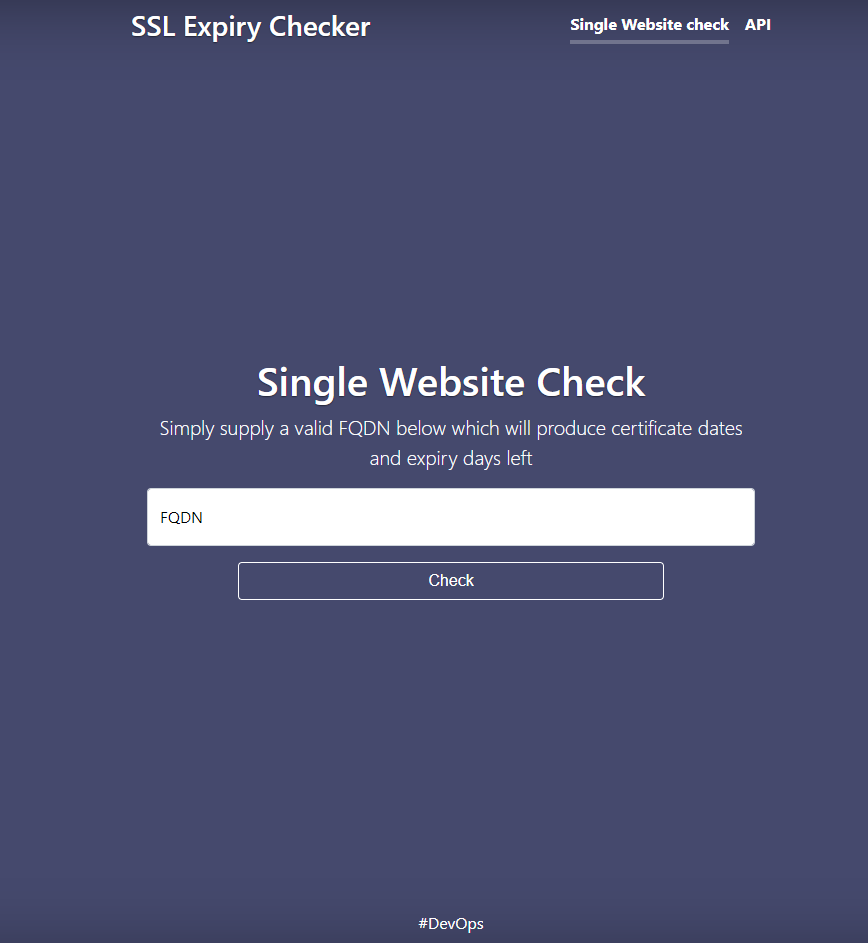
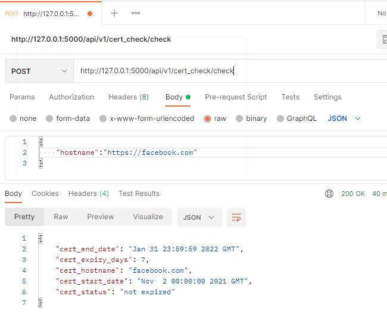

# ssl-expiry-check
Python and Flask Based SSL website expiry checker catering for frontend quick check info on a website or api driven checks.


## Frontend
Simple to use GUI interface, simply add the FQDN(Fully qualified domain name) and check.




## API

api endpoint: 

```
/api/v1/cert_check/check

```

api json payload example: 

```
{
    "hostname":"https://facebook.com"
}

```




### Installation

#### Running locally with Python

1. python -m pip install -r requirements.txt
2. python app.py
3. http://127.0.0.1:5000/

#### Running with docker locally

1. docker run -d -p 80:5004 --name ssl-expiry-container  devationx/ssl-expiry-check
2. http://127.0.0.1/